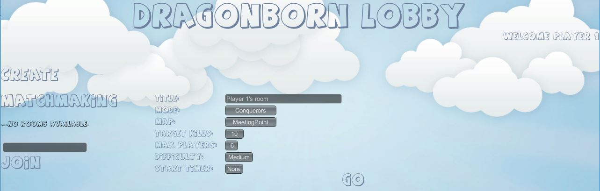
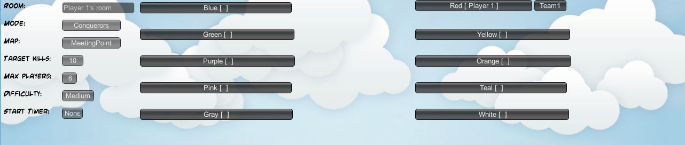
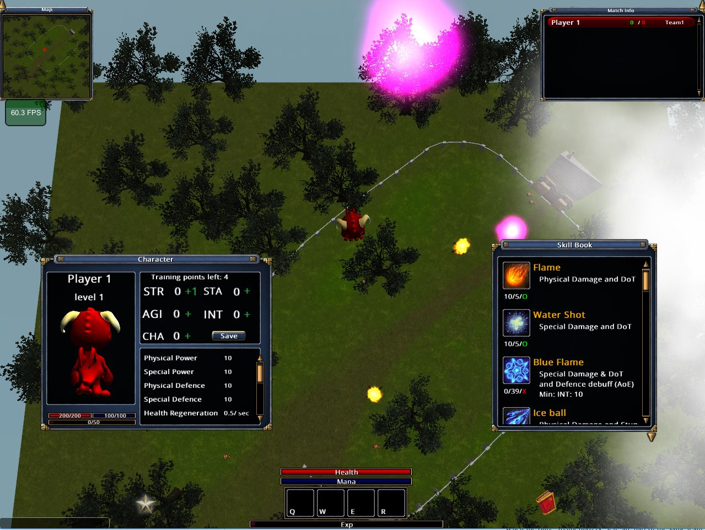
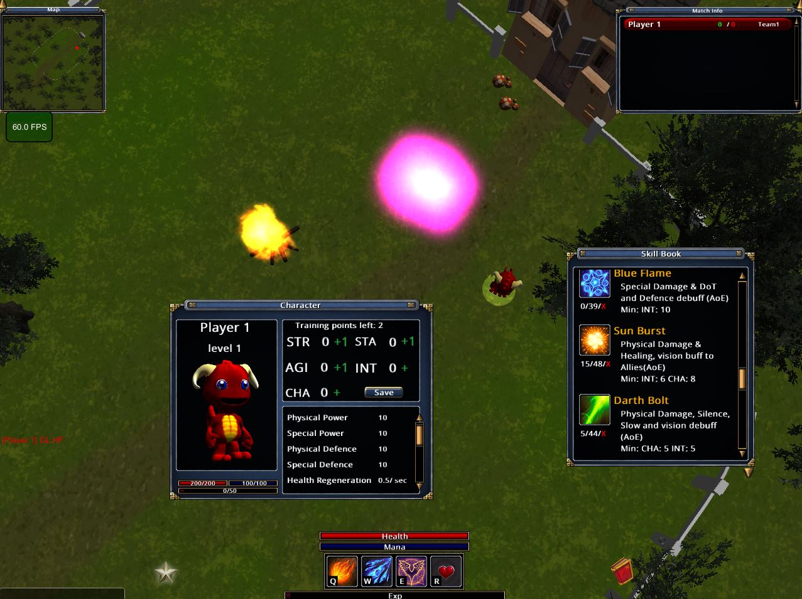
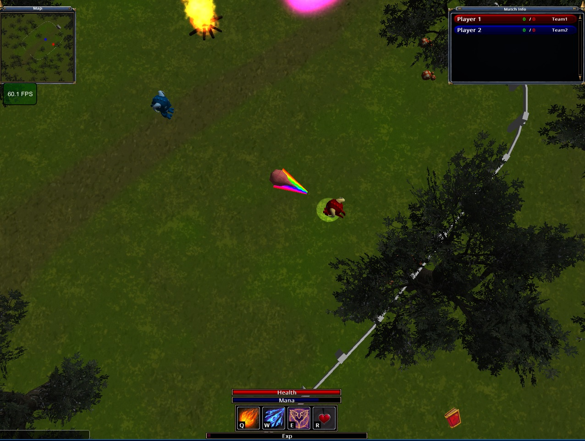
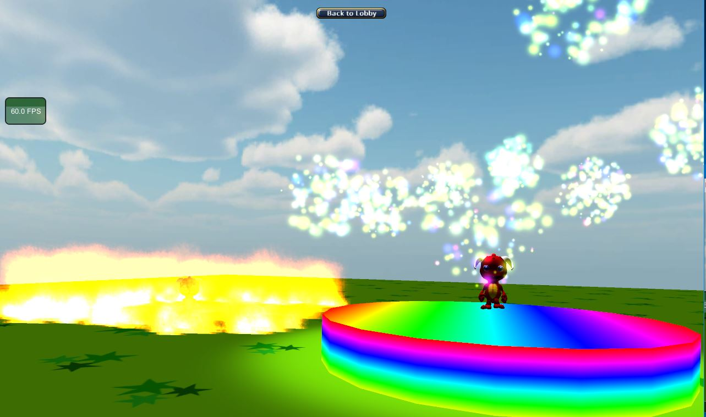

BachelorThesis
==============

## Info

Includes the scripts & config files of the unity project DragonBorn.

DragonBorn is a 3D single hero multiplayer online battle arena (MOBA) game with elements of real time strategy and role playing games.  

More about the design and development process [here](./Documentation/AngelosKyriakopoulosBachelorThesis.pdf)

## Gameplay Video

## Gameplay Screenshots

## Download
Download the demo [here](https://drive.google.com/open?id=0B98e8YqfO7GRMXZ1YkZWZVFpY28)  

Runs on windows and has been tested with around 8 concurrent PC clients.

The game is playable only with human players.

## Controls

| Button        | Action        |
| ------------- |:-------------:|
| Right click   | Movement |
| Q-W-E-R       | Select / Cast corresponding skill |
| Left click    | Cast selected skill  |
| C             | Character panel*  |
| K             | Skills panel  |
| L             | Camera lock/unlock  |
| G             | Options  |

*Drag & drop icons (with the green circle) from the Skills panel
to the four skill slots.

## Single player dummy flow
- Create a game with battle royal mode and with only one starting life.
- When you spawn to the heaven area head to the north and teleport to the field by entering into the pink teleportation sphere.
- Open the character window, hit "+" to each stat and save.
- Play around with the available skills if you feel like it.
- Use the big bang skill that will kill you on the spot so that you will lose your life.
- Check out the winning screen and terminate the game.
